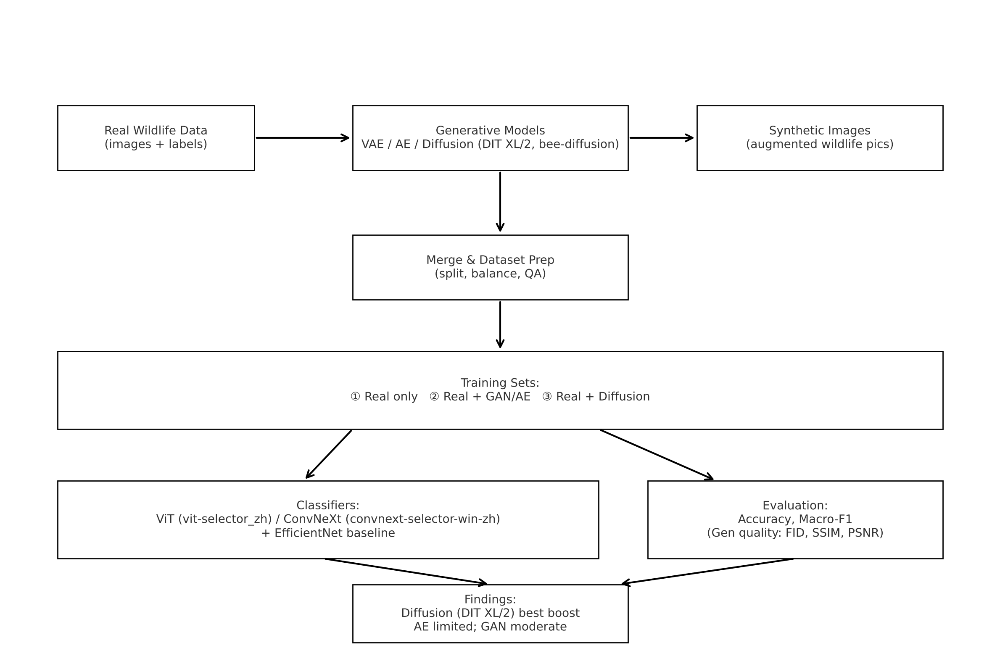

# 🐝 Data Complement for Wildlife Monitoring

**Full Title:** Data Complement: Utilizing Realistic Wildlife Images Generated by Different Models as Training Data to Enhance the Performance of ViT and ConvNeXt Models for Wildlife Monitoring  

This repository is a **monorepo** containing all model implementations used in my research on improving wildlife monitoring systems by generating **realistic synthetic images** to complement small, imbalanced real-world datasets.

---

## 🎯 Research Objective
Wildlife monitoring datasets often suffer from:
- **Data imbalance** (some species have far fewer images)
- **Low quality** (blurry, low-resolution images)
- **Limited quantity** (difficult to capture rare species)

To address these issues, I explored **multiple generative models** to create realistic synthetic images of wildlife (e.g., bees) and **integrated them into training pipelines** for **Vision Transformer (ViT)** and **ConvNeXt** classifiers.  

The goal: **Improve classification accuracy and robustness in biodiversity monitoring**.

---

## 📂 Repository Structure & Model Roles

### 🔹 Generative Models
- `vae-augmentation-yz/` – Variational Autoencoder for image augmentation, generating smooth but lower-detail synthetic images.
- `vae-project-yz/` – Basic VAE implementation for reconstruction experiments.
- `DIT_XL2/` – Diffusion Transformer XL/2 for **high-quality, realistic synthetic image generation**; best performance in limited-data settings.
- `bee-diffusion-zy/` – Custom diffusion model focused on bee image generation for species-specific augmentation.
- `ae-project-ty/` – Autoencoder baseline, reconstructing images without added noise; used for comparison with GAN/Diffusion results.
- `efficientnet_ty/` – Used as an additional classification baseline to measure impact of generated data.

### 🔹 Discriminative Models (Classifiers)
- `vit-selector_zh/` – Vision Transformer model selection and training pipeline; main target model for performance evaluation.
- `convnext-selector-win-zh/` – ConvNeXt model selection and training pipeline; second main target model for evaluation.

---

## 🔬 Methodology Overview
1. **Generate synthetic wildlife images**  
   - Train multiple generative models on existing datasets.  
   - Compare image quality using **FID, SSIM, PSNR** and human visual inspection.

2. **Integrate synthetic images into training**  
   - Merge generated images with real wildlife datasets.  
   - Train ViT and ConvNeXt classifiers on:
     - Real data only
     - Real + GAN/Autoencoder data
     - Real + Diffusion model data

3. **Evaluate performance improvements**  
   - Measure classification accuracy and macro-F1 score.  
   - Identify which generative method provides the best augmentation effect.

---

## 📊 Project Flow Diagram

---
